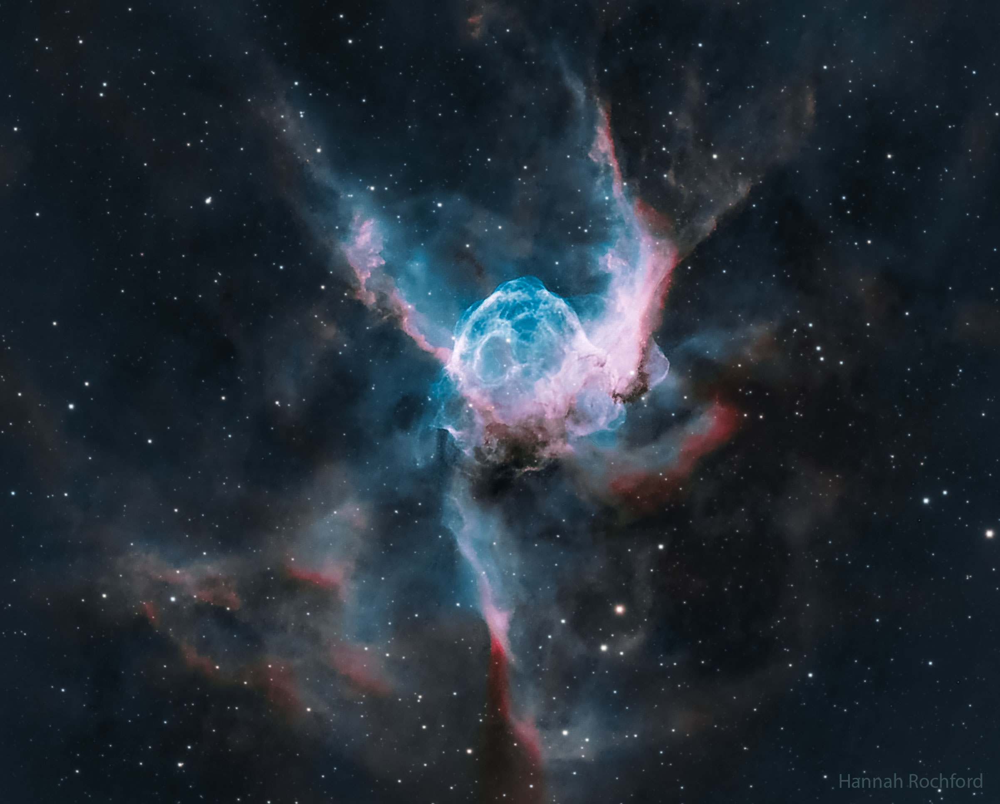
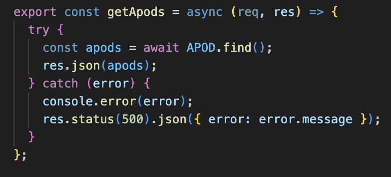
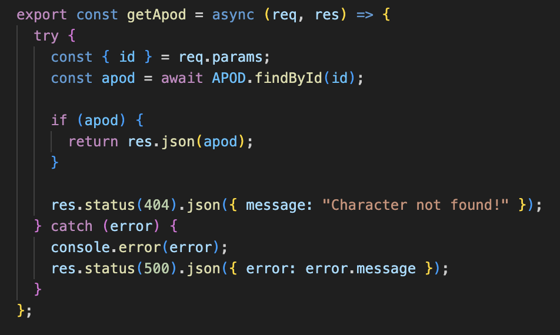
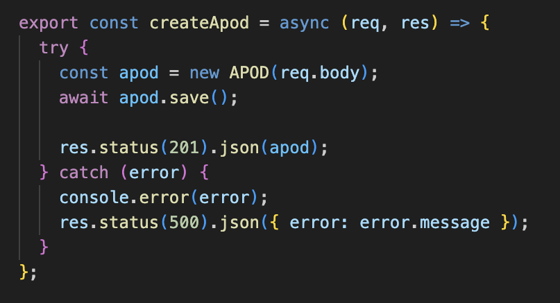
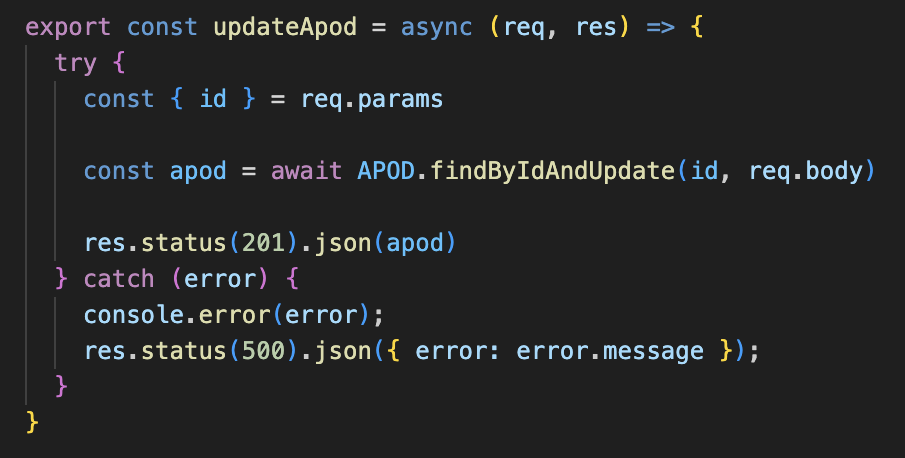
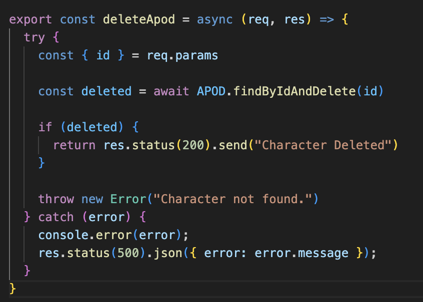

# Astronomy Photo of the Day API

An API for the curious cosmic explorer.

This simple project archives images and information from NASA's Astronomy Photo of the Day for easy navigation. With full CRUD functionality, users can read, add, edit, and delete information from pre-existing or newly created entries that stick to the familiar format of NASA's API. This NASA webpage is one of the most trafficked sites across all federal agencies and has been active every day since 1995.

## Built With

- JavaScript
- Node.js
- Node-Fetch
- Mongoose
- MongoDB
- Express
- FileSystem
- NASA's publicly available APOD API

## Features

- ### Read all entries

- ### Read an entry

- ### Create an entry

- ### Edit an entry

- ### Delete an entry

## Installation instructions

### To set up the app locally:

1. Fork and clone the project repository
2. Install all dependencies locally

## Links

- [Project Repository](#)
- [NASA's List of APIs](#) - [Link.](https://api.nasa.gov/)
- [APOD Repository](#)

